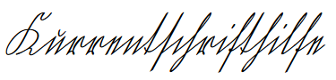

# kurrent
## Kurrentschrifthilfe

The [Kurrent script](https://en.wikipedia.org/wiki/Kurrent) is an old form of German-language handwriting and probably won't be interesting for the English speaking audience, so this documentation is in German.

Die [Kurrentschrift](https://de.wikipedia.org/wiki/Deutsche_Kurrentschrift) ist eine alte Form der deutschsprachigen Handschrift und dürfte für das englischsprachige Publikum nicht interessant sein, daher ist diese Dokumentation in deutscher Sprache.

Die Schrift war etwa seit Beginn der Neuzeit bis in die Mitte des 20. Jahrhunderts die allgemeine Verkehrsschrift im gesamten deutschen Sprachraum. Sie ist heute noch von Bedeutung, wenn alte Dokumente ausgewertet werden sollen, die z.B. von Vorfahren in der Familie vorhanden sind. Dieses Projekt stellt eine HTML-Seite zur Verfügung, die Texteingaben sowohl in der heute üblichen lateinischen Antiqua-Schrift als auch in Kurrentschrift darstellt. Unterstützt werden soll
- das Erlernen der Kurrentschrift und
- das ausprobierende Entziffern von Dokumenten.

Der für die Kurrentschrift verwendete Schriftfont WiegelKurrent.unz1tB.ttf ist von [Peter Wiegel](http://www.peter-wiegel.de/WiegelKurrent.html) und steht unter der Creative Commons-Lizenz CC-BY, GPL mit Font-Exception und/oder SIL Open Font License.
Die Fontdateien wiegelkurrent.unz1tb-webfont.woff, wiegelkurrent.unz1tb-webfont.woff2 und wiegelkurrent.unz1tb-webfont.svg wurden aus der Truetype-Fontdatei WiegelKurrent.unz1tB.ttf mit Hilfe von [Fontsquirrel](https://www.fontsquirrel.com/tools/webfont-generator) in die Formate WOFF, WOFF2 und SVG umgewandelt und stehen ebenfalls unter der Creative Commons-Lizenz CC-BY, GPL mit Font-Exception und/oder SIL Open Font License zur Verfügung.

Die Version 2.0 läuft standalone, der Kurrentfont ist als Base64 direkt eingebunden, so dass keine weiteren Dateien (auch keine Fontdateien) benötigt werden. Um die Datei nicht zu groß werden zu lassen, ist der Font nur im WOFF und WOFF2-Format eingebunden.

[Ausprobieren unter GitHub Pages](https://andreasheese.github.io/kurrent/kurrentschrifthilfe.html)
